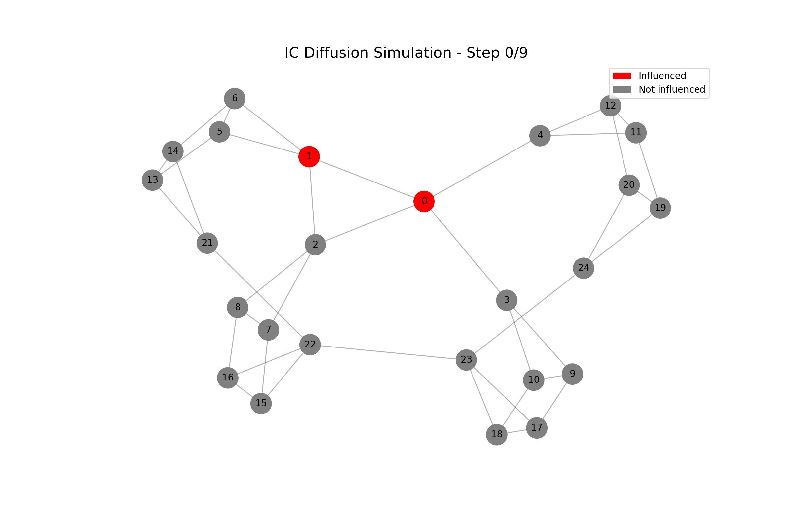

# Target set selection problem

<p align="center">
  
  <br>
  <em>Diffusion process visualization under the IC model</em>
</p>

This project was developed as part of the Algorithmics course (Q2 2022–2023) at [FIB‑UPC](https://www.fib.upc.edu/) by [Fernando Guirao](https://github.com/fer7G), [Àlex Domínguez](https://github.com/alexdoro98), [Haroon Rehman](https://github.com/HaroonUPC) and [Guillem Gaya](https://github.com/GGaya).

## Abstract

The **Target Set Selection** problem (TSS) is a combinatorial optimization problem proposed by Kempe, Kleinberg, and Tardos. The goal is to find a maximum influence (IM) set in a social network. Let $G = (V, E)$ be the graph representing the social network; the objective is to find a set $S$ capable of spreading influence to the largest possible number of nodes in $G$. The spread of influence is studied under the Independent Cascade (IC) model and the Linear Threshold (LT) model.

This problem has two variants: the maximization variant (known as $k$-MAX-influence), where, given a limited number of resources (nodes) $k$, the goal is to maximize the influence spread. On the other hand, in the minimization variant (known as $J$-MIN-Seed), the objective is to find the smallest subset capable of spreading influence to at least $J$ nodes in the network.

This project focuses on the second variant of the problem and aims to provide a solution using a greedy algorithm, a local search, and a metaheuristic.

📄 You can find the full report [here](./report.pdf). (The experimental part could not be 100% completed).

## Test it yourself!

### Requirements

#### C++ requirements

To run the C++ implementations, you only need a standard C++ compiler like `g++`:

```zsh
$ g++ -std=c++17 your_file.cpp -o your_program
```

#### Python requirements (for visualizations)

The visualization script is provided in Python. You can install the required packages with:

```zsh
$ pip install -r requirements.txt
```

### Usage

To try out the algorithms, simply compile the desired `.cpp` file individually and run it using any DIMACS-formatted graph as input. For example:

```zsh
$ g++ -std=c++17 localSearchIC.cpp -o localSearchIC

$ ./localSearchIC < instances/graph_jazz.dimacs
```

The output will display the number of selected seed nodes. If you're running local search or simulated annealing, it will also show the number of seed nodes after optimizing the initial solution.

Inside each C++ file, you can manually adjust parameters in the `main` function, such as the influence probability, the target number of influenced nodes, or algorithm-specific settings (e.g., cooling schedule for simulated annealing).
